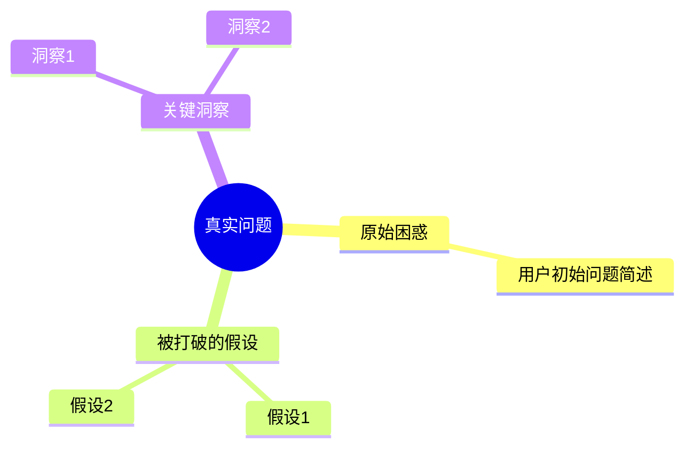

# First Principles - 第一性原理思维助手 (旧版本归档)

## 项目概述

First Principles 是一个基于第一性原理思维方法的 AI 助手，帮助用户打破假设、深入思考、找到问题的真实根因。

## 最终架构 (2026-04-07)

```
┌─────────────────────────────────────────────┐
│         用户浏览器                          │
└──────────────┬──────────────────────────────┘
               │
               ▼
┌─────────────────────────────────────────────┐
│      Astro 前端 (本地开发)                  │
│  - 聊天界面 (端口 4322)                     │
│  - 历史记录                                 │
│  - 思维导图                                 │
└──────────────┬──────────────────────────────┘
               │
               ▼
┌─────────────────────────────────────────────┐
│      Supabase Edge Functions (云端)        │
│  - chat/index.ts (聊天 + 语言检测)          │
│  - health/index.ts (健康检查)               │
│  - mindmap/index.ts (思维导图)              │
└──────────────┬──────────────────────────────┘
               │
               ▼
┌─────────────────────────────────────────────┐
│      Supabase PostgreSQL (云端)            │
│  - conversations (对话会话)                 │
│  - messages (消息记录)                      │
│  - mindmaps (思维导图)                      │
└──────────────┬──────────────────────────────┘
               │
               ▼
┌─────────────────────────────────────────────┐
│      DeepSeek API (外部服务)                │
│  - AI 推理引擎                              │
│  - 支持中英文自动检测                       │
└─────────────────────────────────────────────┘
```

## 技术栈

| 组件 | 技术 | 状态 |
|------|------|------|
| 前端框架 | Astro | ✅ 本地开发 |
| 后端 | Supabase Edge Functions | ✅ 云端运行 |
| 数据库 | Supabase PostgreSQL | ✅ 云端托管 |
| 认证 | Supabase Auth | ✅ 已配置 |
| AI 服务 | DeepSeek API | ✅ 集成完成 |

## 已实现功能

- ✅ 聊天对话 (SSE 流式响应)
- ✅ 语言自动检测 (中文/英文/其他)
- ✅ AI 以相同语言回复
- ✅ 对话历史记录
- ✅ 思维导图生成 (Mermaid)
- ✅ 使用次数限制 (3 次)
- ✅ 健康检查 API

## 快速开始

### 1. 安装依赖
```bash
cd /root/.openclaw/workspace-developer-xue/first-principles
npm install
```

### 2. 环境变量
已配置在 `.env` 文件中：
- `SUPABASE_URL`: Supabase 项目 URL
- `SUPABASE_ANON_KEY`: Supabase 匿名密钥
- `DEEPSEEK_API_KEY`: DeepSeek API 密钥
- `PORT`: 固定端口 4322

### 3. 启动服务器
```bash
npm run dev
```

### 4. 访问应用
- 本地: http://localhost:4322
- 公网: http://43.153.79.127:4322

## 项目结构

```
first-principles/
├── src/                    # Astro 源代码
│   ├── pages/             # 页面组件
│   ├── components/        # React 组件
│   └── data/              # 静态数据 (SKILL.md)
├── server/                # Express 服务器 (本地开发)
│   ├── index.cjs          # 主服务器文件
│   ├── db.cjs             # SQLite 数据库
│   └── public-placeholder/# 静态 HTML 文件
├── supabase/              # Supabase 配置
│   └── functions/         # Edge Functions
│       ├── chat/          # 聊天功能
│       ├── health/        # 健康检查
│       └── mindmap/       # 思维导图
├── public/                # 静态资源
├── .env                   # 环境变量 (端口固定 4322)
├── package.json           # 项目配置
├── astro.config.mjs       # Astro 配置
└── README.md              # 本文件
```

## API 端点

### 本地开发服务器
- `POST /api/chat` - 聊天对话 (SSE)
- `GET /api/conversations` - 获取对话列表
- `POST /api/conversations` - 创建新对话
- `POST /api/mindmap` - 生成思维导图
- `GET /api/usage` - 获取使用情况

### Supabase Edge Functions
- `POST https://bmstklfbnyevuyxidmhv.supabase.co/functions/v1/chat`
- `GET https://bmstklfbnyuyxidmhv.supabase.co/functions/v1/health`

## 核心特性

### 1. 语言自动检测
```javascript
// 自动检测用户输入语言
function detectLanguage(text) {
  const chineseRegex = /[\u4e00-\u9fff]/;
  const englishRegex = /[a-zA-Z]/;
  
  // 基于字符统计的轻量级算法
  // 返回: 'chinese' | 'english' | 'other'
}
```

### 2. 第一性原理思维框架
基于 SKILL.md 中的思维指导：
1. 理解原始困惑
2. 打破假设
3. 建立公理
4. 逻辑推演
5. 验证结论

### 3. 思维导图生成
自动生成 Mermaid 格式的思维导图：


## 开发指南

### 添加新页面
1. 在 `server/public-placeholder/` 创建 HTML 文件
2. 在 `server/index.cjs` 添加路由：
```javascript
app.get('/new-page', serveHTML('new-page.html'));
```

### 修改 AI 行为
编辑 `src/data/skill.md`，定义 AI 的思维框架和行为。

### 部署 Edge Function
```bash
cd supabase
supabase functions deploy function-name --no-verify-jwt
```

## 故障排除

### 端口被占用
```bash
# 查看端口占用
lsof -i :4322
# 杀死进程
kill -9 <PID>
```

### 数据库问题
```bash
# 重置数据库
rm /tmp/fp-db.sqlite3
npm run dev
```

### Supabase 连接失败
1. 检查网络连接
2. 验证 `.env` 中的配置
3. 查看浏览器控制台错误

## 性能优化

- 使用 Supabase Edge Functions (全球边缘网络)
- 客户端缓存对话历史
- SSE 流式响应 (减少首字节时间)
- 静态资源压缩

## 安全考虑

- API 密钥存储在 `.env` (不提交到 Git)
- Supabase RLS (Row Level Security) 启用
- CORS 配置限制访问来源
- 使用环境变量管理敏感信息

## 成本估算

| 服务 | 免费层 | 月成本 |
|------|--------|--------|
| Astro (本地) | ✅ | $0 |
| Supabase | ✅ | $0 |
| DeepSeek API | 部分 | $0-10 |

## 未来计划

- [ ] 前端部署到 Cloudflare Pages
- [ ] 添加用户认证
- [ ] 多模型支持 (OpenAI, Claude)
- [ ] 团队协作功能
- [ ] 移动端应用

## 技术支持

- **GitHub Issues**: 项目仓库
- **文档**: `/about` 页面
- **健康检查**: http://localhost:4322/api/health

## 许可证

MIT License

---

**版本**: 2.0.0  
**最后更新**: 2026-04-07  
**架构**: Astro + Supabase  
**状态**: ✅ 稳定运行
